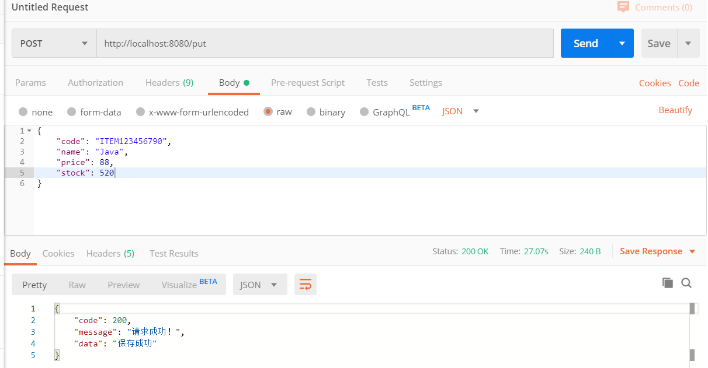
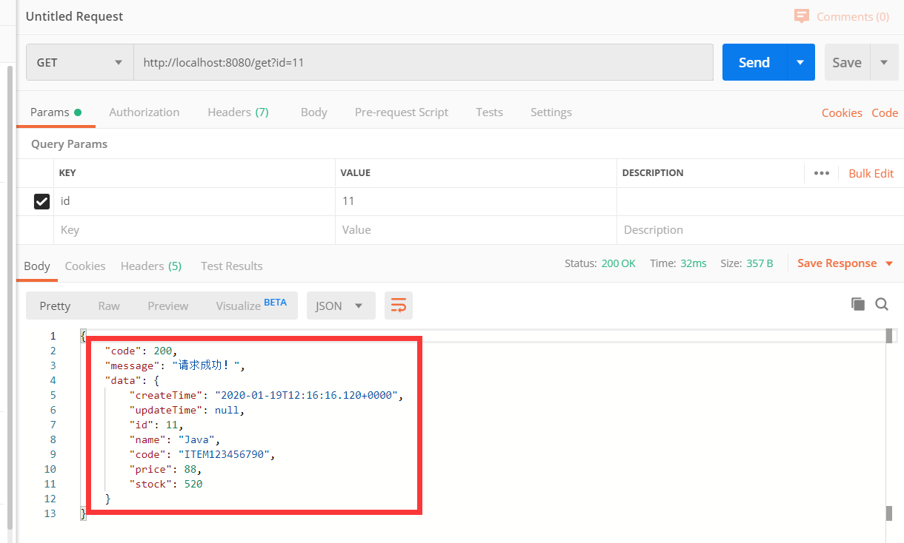
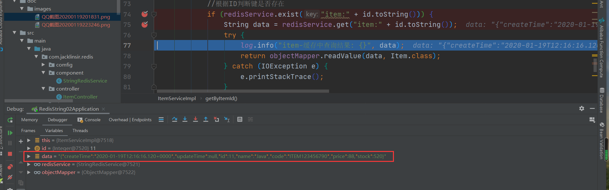

## Redis实战（2）String数据结构
概述

下面我们介绍一下redis中比较常见的字符串存储结构，String数据结构，在项目中也比较常用，下面我来介绍具体项目应用常见。
其中应用场景为“存储前端门户网站的商品详情信息”，从而减少数据库DB的访问频率，提高接口的响应速率！

### 一
在redis中间件中拥有着多种数据结构，五花八门，现在我们来介绍一下Redis常见的String数据结构，
也使用相当广泛，下面我基于SpringBoot2.x+Redis作为基奠来体现String应用场景。

> 首先我们准备一个Redis服务器，相信你能看到这篇文章你的redis服务器环境已经搭建好了，如果没有，请自行搭建，很简单，这里推荐使用Docker，
>如果你不会docker，可以使用文件解压方式使用，具体使用请Google，教程非常成熟。

### 二
String典型应用场景代码实战

 1. 业务场景介绍，下面我们以“访问前端门户网站商品信息”为业务场景，在后端平台添加热门商品信息的时候，在保存到数据库
业务逻辑的时候我们顺便也把数据塞一份到Redis服务器中，在下一次访问的时候，我们先判断商品信息是否存在redis服务器中，如果在则不需要查询数据库，
直接查询redis服务器，这样有效提高了接口响应的速度，同时也为DB服务器减轻压力和负载。

2. 首先我们先开发一个controller控制器，然后调用业务层的服务接口。controller业务比较简单，请看以下代码：
```java
package com.jacklinsir.redis.controller;

import com.jacklinsir.redis.model.Item;
import com.jacklinsir.redis.result.CommonResult;
import com.jacklinsir.redis.service.ItemService;
import org.springframework.beans.factory.annotation.Autowired;
import org.springframework.http.MediaType;
import org.springframework.validation.BindingResult;
import org.springframework.validation.annotation.Validated;
import org.springframework.web.bind.annotation.*;

/**
 * @author linSir
 * @version V1.0
 * @Date 2020/1/18 23:11
 */
@RestController
public class ItemController {

    @Autowired
    private ItemService itemService;


    /**
     * 保存商品
     *
     * @param item
     * @param result
     * @return
     */
    @PostMapping(value = "/put")
    public CommonResult put(@RequestBody @Validated Item item, BindingResult result) {
        if (result.hasErrors()) {
            return CommonResult.fail();
        }
        return itemService.add(item) == 1 ? CommonResult.success("保存成功") : CommonResult.fail();
    }

    /**
     * 获取商品
     *
     * @param id
     * @return
     */
    @GetMapping("/get")
    public CommonResult get(@RequestParam("id") Integer id) {
        Item item = itemService.getByItemId(id);
        return item != null ? CommonResult.success(item) : CommonResult.fail();
    }
}
```
3 . 从上面代码可以看出，其实真正实现业务逻辑的是 ItemService业务层，由此，我们继续看业务层代码：
```java
package com.jacklinsir.redis.service.impl;

import com.fasterxml.jackson.core.JsonProcessingException;
import com.fasterxml.jackson.databind.ObjectMapper;
import com.jacklinsir.redis.component.StringRedisService;
import com.jacklinsir.redis.dao.ItemDao;
import com.jacklinsir.redis.model.Item;
import com.jacklinsir.redis.service.ItemService;
import lombok.extern.slf4j.Slf4j;
import org.springframework.beans.factory.annotation.Autowired;
import org.springframework.stereotype.Component;
import org.springframework.stereotype.Service;
import org.springframework.transaction.annotation.Transactional;

import java.io.IOException;
import java.util.Date;
import java.util.UUID;

/**
 * @author linSir
 * @version V1.0
 * @Date 2020/1/18 22:15
 */
@Slf4j
@Service
public class ItemServiceImpl implements ItemService {
    /**
     * 注入dao组件
     */
    @Autowired
    private ItemDao itemDao;

    /**
     * 注入Redis服务组件
     */
    @Autowired
    private StringRedisService redisService;

    @Autowired
    private ObjectMapper objectMapper;

    @Transactional(rollbackFor = Exception.class)
    @Override
    public int add(Item item) {
        //补充相关属性初始化值
        item.setCreateTime(new Date());
        item.setId(null);
        int index = itemDao.add(item);
        Integer id = item.getId();
        //判断一下保证缓存和数据库双写一致性
        if (index > 0) {
            //将数据序列化成json保存到redis 缓存中
            try {
                redisService.put("item:" + id.toString(), objectMapper.writeValueAsString(item));
                log.info("item数据保存到缓存中成功: {}", item);
            } catch (JsonProcessingException e) {
                e.printStackTrace();
                log.info("item数据保存到缓存中异常: {}", e.getMessage());
            }
        }
        return index;
    }

    /**
     * 根据ID获取商品
     *
     * @param id
     * @return
     */
    @Override
    public Item getByItemId(Integer id) {
        if (id != null) {
            //根据ID判断键是否存在
            if (redisService.exist("item:" + id.toString())) {
                String data = redisService.get("item:" + id.toString());
                try {
                    log.info("item-缓存中查询结果: {}", data);
                    return objectMapper.readValue(data, Item.class);
                } catch (IOException e) {
                    e.printStackTrace();
                }
            } else {
                //去查询数据库
                Item item = itemDao.getByItemId(id);
                if (item != null) {
                    return item;
                }
                return null;
            }
        }
        return null;
    }
}
``` 
4.上面具体业务逻辑可以值得一提：
+ 我们在添加商品的时候，同时也像redis缓存中塞了一份，但是为了保证“双写一致性”，
我们唯一能做的就是先保证数据库一定要先保存成功，才能在像缓存中插入数据，不然会违背双写一致性。
+ 商品信息是一个实体对象，为了能将数据保存到redis缓存中，因为redis数据结构事String字符串，只能保存相关字符串，所以我们需要把对信息序列化成json字符串，
所以这里我们采用了jackson的序列化机制，将实体转换字符串，然后保存到redis服务器。

+ 在“获取热门商品详情”时，我们当然是根据Key直接进行获取，
但由于其结果是String类型的Json格式字符串常量值，故而我们需要将其“反序列化”，
即同样也是采用Jackson的反序列化机制，将其映射到一个Item实体对象中即可。

5.从上面代码我们可以看到主要存入数据库和redis ，我来说一下StringRedisService组件，为什么要写这个组件，在为了代码的耦合性和我们是面向服务编程，
这样的好处是代码更加层次分明，所以更加推荐服务注入方式来开发。下面我们来看一下相关的组件的代码实现：
```java
package com.jacklinsir.redis.component;

import org.springframework.beans.factory.annotation.Autowired;
import org.springframework.data.redis.core.RedisTemplate;
import org.springframework.data.redis.core.StringRedisTemplate;
import org.springframework.stereotype.Service;

/**
 * redis服务组件
 *
 * @author linSir
 * @version V1.0
 * @Date 2020/1/18 22:18
 */
@Service
public class StringRedisService {

    @Autowired
    private StringRedisTemplate redisTemplate;

    /**
     * 向redis存储数据
     *
     * @param key
     * @param value
     */
    public void put(String key, Object value) {
        redisTemplate.opsForValue().set(key, value.toString());
    }


    /**
     * 从redis获取数据
     *
     * @param key
     * @return
     */
    public String get(String key) {
        return redisTemplate.opsForValue().get(key);
    }

    /**
     * 根据key判断是否存在
     *
     * @param key
     * @return
     */
    public boolean exist(String key) {
        return redisTemplate.opsForValue().get(key) != null;
    }
}
```
6 . 测试结果

put:

get:


查询缓存结果:


[源代码](https://github.com/Jacklinsir/Redis-ApplicationScene/tree/master/redis-string-02)

